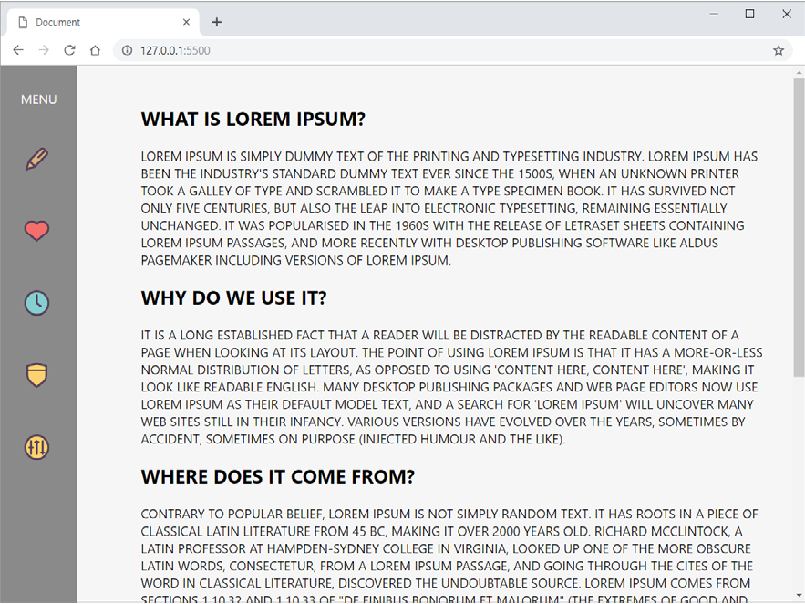
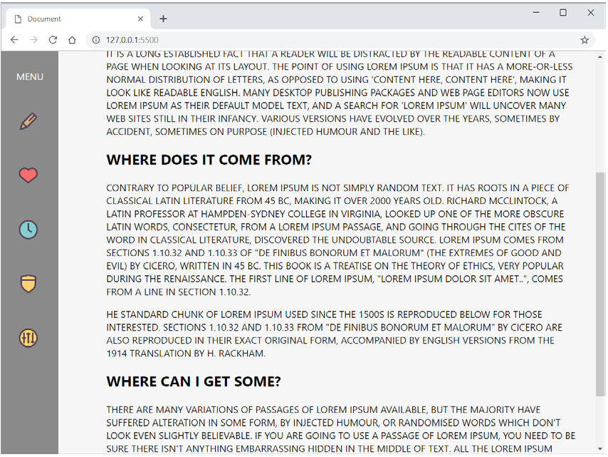
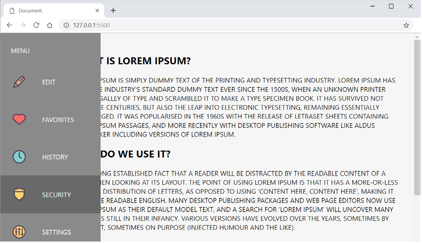

# 8._Transforms-_transitions_and_animations

Implement according to the screenshot example:

## Переход

# "Developing web pages in HTML5 markup language
using CSS3 Cascading Style Sheets"
Module 4: Animation in CSS3

## Task 1

Implement an html page with a clock.
When you open the page, the clock hands should move
endlessly. The minute hand must move faster than
hour hand.
End result example:

## Task 2

Implement an html page with sashes.
Initially, two identical blocks are displayed on the page, behind which the text is hidden. When you hover your mouse over any
from the blocks, they slowly (in 2 seconds) open up so that
text was visible. If the mouse is taken away, then everything abruptly returns to
original state.
Initial state example:

An example of the state of the block when hovering with the mouse, when the animation
ended:

